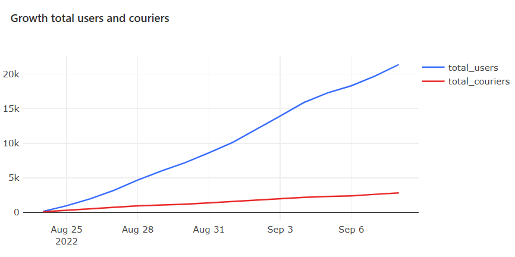
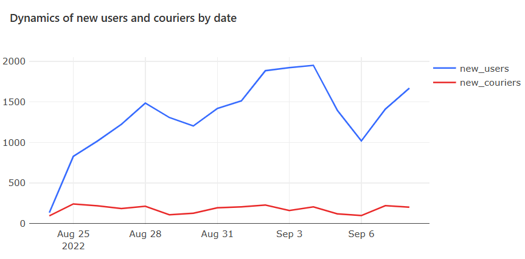
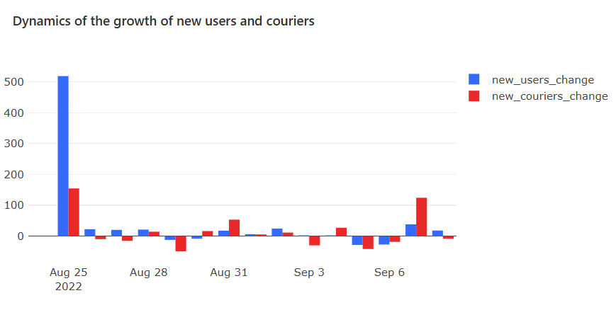
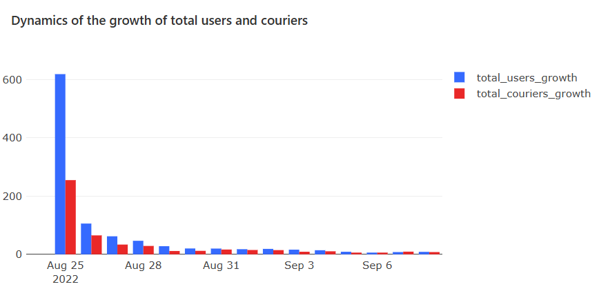

# 📦 E-Commerce & Delivery Analytics
 
> **Pet-проект** — аналитика продуктового онлайн-магазина с курьерской доставкой.  
> Все запросы написаны на **PostgreSQL** с использованием **Redash**. Визуализации собраны в дашбордах **Redash**

---
<br>

# 📌 О проекте

 
В рамках проекта проведён комплексный анализ платформы e-commerce с доставкой, включая рост пользователей и курьеров, юнит-экономику, маркетинговую эффективность и удержание пользователей. Проведено вычисление метрик (`arpu`, `arppu`, `aov`, `conversion rate`, `cac`, `roi`, `retention` и другие) и их визуализация
 
**Источник данных:** Тренажер SQL karpov.courses
 
**Инструменты, навыки:** PostgreSQL · Redash · Window functions · Aggregations · CTEs · JOINs

---
<br>

# 📂 Дашборды
**Ссылки на дашборды:** [первая часть](https://redash.public.karpov.courses/public/dashboards/fMSL6Gr130go4EDCw1QVwJxLVi1kStSEfdKhGRG0?org_slug=default), [вторая часть](https://redash.public.karpov.courses/public/dashboards/wbQFlGJ88ncnJHY9xq1N3mk7KJnMg3hJG2YPEwGj?org_slug=default), [третья часть](https://redash.public.karpov.courses/public/dashboards/ODMMoGPDV39EhpUnEqo6CyDtkeho5hAbto67XJok?org_slug=default)

---
<br>

# 🐘 SQL-запросы


## 1. 📈 Рост пользователей и курьеров
### Рост общего числа пользователей и курьеров + количество новых пользователей и курьеров по дням + относительные показатели прироста в процентах по дням
<p>
  
  
</p>
<p>
  
  
</p>


```sql
with new_user as (SELECT date,
                         count(user_id) as new_users
                  FROM   (SELECT user_id,
                                 min(date(time)) as date
                          FROM   user_actions
                          GROUP BY user_id) t1
                  GROUP BY date), new_courier as (SELECT date,
                                       count(courier_id) as new_couriers
                                FROM   (SELECT courier_id,
                                               min(date(time)) as date
                                        FROM   courier_actions
                                        GROUP BY 1) t2
                                GROUP BY 1), rezult as (SELECT date,
                               new_users,
                               new_couriers
                        FROM   new_user
                            LEFT JOIN new_courier using(date))
SELECT date,
       new_users,
       new_couriers,
       total_users,
       total_couriers,
       round(new_users::decimal/lag(new_users) OVER(ORDER BY date) * 100 - 100,
             2) as new_users_change,
       round(new_couriers::decimal/lag(new_couriers) OVER(ORDER BY date) * 100 - 100,
             2) as new_couriers_change,
       round(total_users::decimal/lag(total_users) OVER(ORDER BY date) * 100 - 100,
             2) as total_users_growth,
       round(total_couriers::decimal/lag(total_couriers) OVER(ORDER BY date) * 100 - 100,
             2) as total_couriers_growth
FROM   (SELECT date,
               new_users,
               new_couriers,
               (sum(new_users) OVER (ORDER BY date))::int as total_users,
               (sum(new_couriers) OVER (ORDER BY date))::int as total_couriers
        FROM   rezult) t1
```
**Вопросы:**
> 1) Что растёт быстрее: количество пользователей или количество курьеров?
> 2) Насколько стабильны показатели числа новых пользователей и курьеров? Нет ли в данных таких дней, когда показатели сильно выбивались из общей динамики?
> 3) Можно ли сказать, что показатель числа новых курьеров более стабилен, чем показатель числа новых пользователей?
> 4) Как изменились темпы прироста общего числа пользователей и курьеров за рассматриваемый промежуток времени? Какая в целом динамика у этих показателей: они растут или, наоборот, затухают?
> 5) В какие дни темп прироста числа новых курьеров заметно опережал темп прироста числа новых пользователей?
> 6) Можно ли, глядя на графики с относительными показателями, сказать, что показатель числа новых курьеров более стабилен, чем показатель числа новых пользователей?

**Ответы:**
> 1) Количество пользователей растет быстрее, чем количество курьеров. 134 пользователя и 95 курьеров в момент запуска платформы 24 августа 2022 и 21401 пользователь и 2826 курьеров в конце анализируемого периода 8 сентября 2022 года
> 2) Показатели числа новых пользователей нестабильны, на протяжении всего времени видны колебания. В свою очередь показатели числа новых курьеров достаточно стабильны. Своего пика число новых пользователей достигает 4 сентября 2022 - 1952 пользователя. После чего достигает своего минимума (с 27 августа) - 1020 пользоватлей 6 сентября. Это может быть связано с маркетинговыми активностями компании или сбоями в работе приложения.
> 3) Да, показатель числа новых курьеров более стабилен, чем показатель числа новых пользователей. Нет аномальных изменений или сильных колебаний. Число новых курьеров принимает значения от 95 (24 августа) до 242 (25 августа)
> 4) Темпы прироста общего числа пользователей были ~ 619%, а общего числа курьеров ~ 255% 25 августа. В конце рассматриваемого периода 8 сентября эти показатели ~ 8%. Динамика показателей отрицательная, они затухают
> 5) 30 августа (~ 16,5% и -8%), 31 августа (~ 53,5% и 18%), 4 сентября (~ 27,3% и 1,5%), 7 сентября (~ 124,5% и 38,5)
> 6) Глядя на графики с относительными показателями сказать, что показатель числа новых курьеров более стабилен нельзя. Это можно сказать только анализируя графики с абсолютными показателями
--- 

 
## 2. 🚚 Заказы и операции

