# 📦 E-Commerce & Delivery Analytics
 
> **Pet-проект** — аналитика продуктового онлайн-магазина с курьерской доставкой.  
> Все запросы написаны на **PostgreSQL** с использованием **Redash**. Визуализации собраны в дашбордах **Redash**

---
<br>

# 📌 О проекте

 
В рамках проекта проведён комплексный анализ платформы e-commerce с доставкой, включая рост пользователей и курьеров, юнит-экономику, маркетинговую эффективность и удержание пользователей. Проведено вычисление метрик (`arpu`, `arppu`, `aov`, `conversion rate`, `cac`, `roi`, `retention` и другие) и их визуализация
 
**Источник данных:** Тренажер SQL karpov.courses
 
**Инструменты, навыки:** PostgreSQL · Redash · Window functions · Aggregations · CTEs · JOINs

---
<br>

# 📂 Дашборды
**Ссылки на дашборды:** [первая часть](https://redash.public.karpov.courses/public/dashboards/fMSL6Gr130go4EDCw1QVwJxLVi1kStSEfdKhGRG0?org_slug=default), [вторая часть](https://redash.public.karpov.courses/public/dashboards/wbQFlGJ88ncnJHY9xq1N3mk7KJnMg3hJG2YPEwGj?org_slug=default), [третья часть](https://redash.public.karpov.courses/public/dashboards/ODMMoGPDV39EhpUnEqo6CyDtkeho5hAbto67XJok?org_slug=default)

---
<br>

# 🐘 SQL-запросы


## 1. 📈 Рост пользователей и курьеров
### Рост общего числа пользователей и курьеров + количество новых пользователей и курьеров по дням + относительные показатели прироста в процентах по дням
<p>
  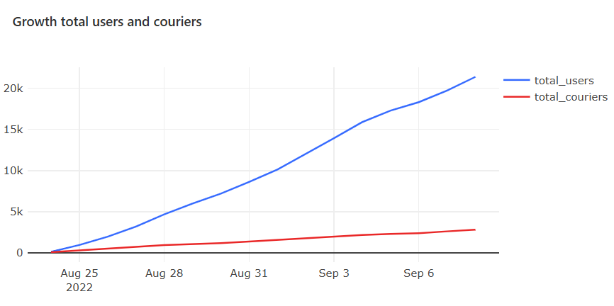
  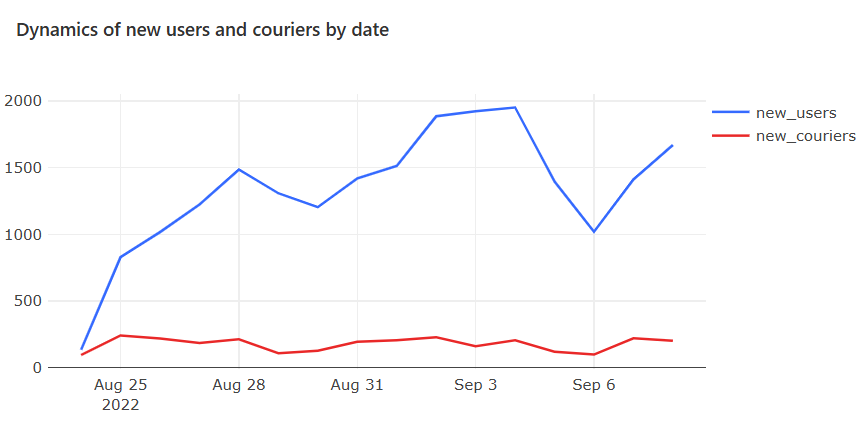
</p>
<p>
  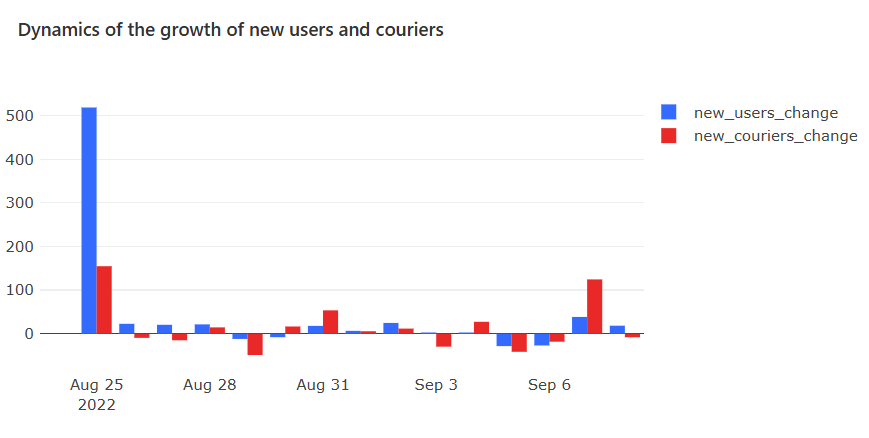
  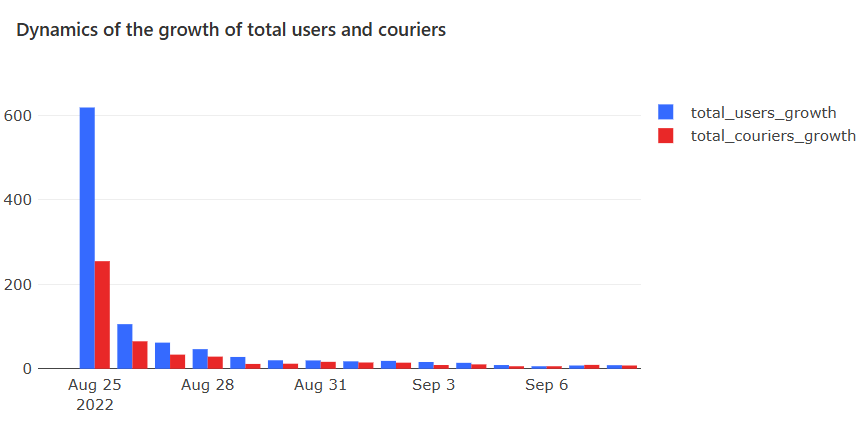
</p>


```sql
with new_user as (SELECT date,
                         count(user_id) as new_users
                  FROM   (SELECT user_id,
                                 min(date(time)) as date
                          FROM   user_actions
                          GROUP BY user_id) t1
                  GROUP BY date), 
new_courier as (SELECT date,
                       count(courier_id) as new_couriers
                FROM   (SELECT courier_id,
                               min(date(time)) as date
                        FROM   courier_actions
                        GROUP BY 1) t2
                GROUP BY 1), 
rezult as (SELECT date,
                  new_users,
                  new_couriers
           FROM   new_user
           LEFT JOIN new_courier using(date))
SELECT date,
       new_users,
       new_couriers,
       total_users,
       total_couriers,
       round(new_users::decimal/lag(new_users) OVER(ORDER BY date) * 100 - 100,
             2) as new_users_change,
       round(new_couriers::decimal/lag(new_couriers) OVER(ORDER BY date) * 100 - 100,
             2) as new_couriers_change,
       round(total_users::decimal/lag(total_users) OVER(ORDER BY date) * 100 - 100,
             2) as total_users_growth,
       round(total_couriers::decimal/lag(total_couriers) OVER(ORDER BY date) * 100 - 100,
             2) as total_couriers_growth
FROM   (SELECT date,
               new_users,
               new_couriers,
               (sum(new_users) OVER (ORDER BY date))::int as total_users,
               (sum(new_couriers) OVER (ORDER BY date))::int as total_couriers
        FROM   rezult) t1
```
**Вопросы:**
> 1) Что растёт быстрее: количество пользователей или количество курьеров?
> 2) Насколько стабильны показатели числа новых пользователей и курьеров? Нет ли в данных таких дней, когда показатели сильно выбивались из общей динамики?
> 3) Можно ли сказать, что показатель числа новых курьеров более стабилен, чем показатель числа новых пользователей?
> 4) Как изменились темпы прироста общего числа пользователей и курьеров за рассматриваемый промежуток времени? Какая в целом динамика у этих показателей: они растут или, наоборот, затухают?
> 5) В какие дни темп прироста числа новых курьеров заметно опережал темп прироста числа новых пользователей?
> 6) Можно ли, глядя на графики с относительными показателями, сказать, что показатель числа новых курьеров более стабилен, чем показатель числа новых пользователей?

**Ответы:**
> 1) Количество пользователей растет быстрее, чем количество курьеров. 134 пользователя и 95 курьеров в момент запуска платформы 24 августа 2022 и 21401 пользователь и 2826 курьеров в конце анализируемого периода 8 сентября 2022 года
> 2) Показатели числа новых пользователей нестабильны, на протяжении всего времени видны колебания. В свою очередь показатели числа новых курьеров достаточно стабильны. Своего пика число новых пользователей достигает 4 сентября 2022 - 1952 пользователя. После чего достигает своего минимума (с 27 августа) - 1020 пользоватлей 6 сентября. Это может быть связано с маркетинговыми активностями компании или сбоями в работе приложения.
> 3) Да, показатель числа новых курьеров более стабилен, чем показатель числа новых пользователей. Нет аномальных изменений или сильных колебаний. Число новых курьеров принимает значения от 95 (24 августа) до 242 (25 августа)
> 4) Темпы прироста общего числа пользователей были ~ 619%, а общего числа курьеров ~ 255% 25 августа. В конце рассматриваемого периода 8 сентября эти показатели ~ 8%. Динамика показателей отрицательная, они затухают
> 5) 30 августа (~ 16,5% и -8%), 31 августа (~ 53,5% и 18%), 4 сентября (~ 27,3% и 1,5%), 7 сентября (~ 124,5% и 38,5)
> 6) Глядя на графики с относительными показателями сказать, что показатель числа новых курьеров более стабилен нельзя. Это можно сказать только анализируя графики с абсолютными показателями
--- 

 
## 2. 🚚 Заказы и операции
### Динамика платящих пользователей и активных курьеров по дням и их доли в общем числе пользователей и курьеров


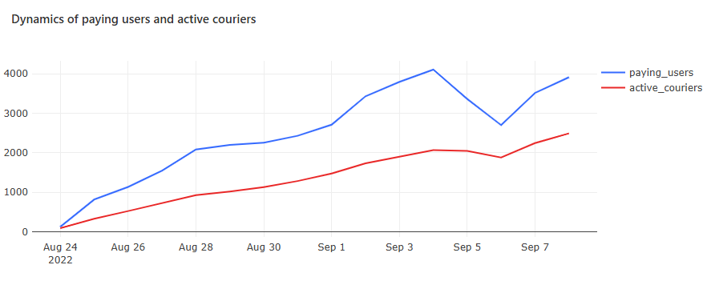

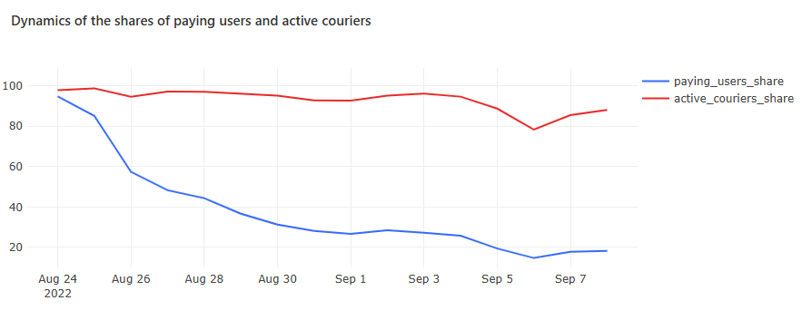


```sql
with new_user as (SELECT date,
                         count(user_id) as new_users
                  FROM   (SELECT user_id,
                                 min(date(time)) as date
                          FROM   user_actions
                          GROUP BY user_id) t1
                  GROUP BY date), 
new_courier as (SELECT date,
                       count(courier_id) as new_couriers
                FROM   (SELECT courier_id,
                               min(date(time)) as date
                        FROM   courier_actions
                        GROUP BY 1) t2
                GROUP BY 1), 
rezult as (SELECT date,
                  new_users,
                  new_couriers
            FROM   new_user
            LEFT JOIN new_courier using(date)), 
new as (SELECT date,
               new_users,
               new_couriers,
               (sum(new_users) OVER (ORDER BY date))::int as total_users,
               (sum(new_couriers) OVER (ORDER BY date))::int as total_couriers
        FROM   rezult), 
sub as (SELECT date(time) as date,
               count(distinct user_id) as paying_users
        FROM   user_actions
        WHERE  action = 'create_order'
               and order_id not in (SELECT order_id
                                    FROM   user_actions
                                    WHERE  action = 'cancel_order')
        GROUP BY 1), 
sub1 as (SELECT date(time) as date,
                count(distinct courier_id) as active_couriers
         FROM   courier_actions
         WHERE  order_id in (SELECT order_id
                             FROM   courier_actions
                             WHERE  action = 'deliver_order')
         GROUP BY 1), 
rezult1 as (SELECT date,
                   paying_users,
                   active_couriers
            FROM   sub
            LEFT JOIN sub1 using(date))
SELECT date,
       paying_users,
       active_couriers,
       round(paying_users::decimal/total_users*100, 2) as paying_users_share,
       round(active_couriers::decimal/total_couriers*100, 2) as active_couriers_share
FROM   rezult1
    LEFT JOIN new using(date)
ORDER BY date

```
**Вопросы:**
> 1) Можно ли сказать, что вместе с общим числом пользователей и курьеров растёт число платящих пользователей и активных курьеров? 
> 2) Как в то же время ведут себя показатели долей платящих пользователей и активных курьеров? Можно ли считать их текущую динамику в целом нормальной и закономерной?

**Ответы:**
> 1) Да, вместе с общим числом пользователей и курьеров растет число платящих пользователей и активных курьеров. Увеличивается общее число пользователей - число платящих пользователей, которые делают заказы, становится также больше - привлекается больше курьеров, чтобы доставлять эти заказы
> 2) Показатели долей платящих пользователей и активных курьеров снижаются. с ~ 98% до ~ 88% для активных курьеров и с ~ 95% до  ~ 18% для платящих пользователей. Такую динамику можно считать в целом нормальной и закономерной: сервис не предусматривает того, чтобы пользователи делали в нем заказы ежедневно. В первый день 98% пользователей сделали заказ и со временем это значение падает из-за роста общего числа пользователей (знаменатель увеличивается, а новые пользователи не делают заказы ежедневно). Доля активных курьеров высокая (~ 88%-98%). Снижение на 10% также обусловлено ростом общего числа курьеров

--- 

### Доля пользователей с одним и несколькими заказами

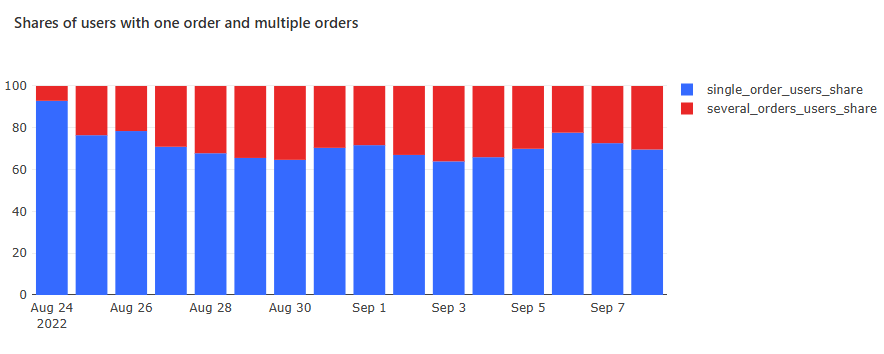

```sql

with sub as (SELECT date,
                    count(num) filter (WHERE num = 1) as single_order_users_share,
                    count(num) filter (WHERE num != 1) as several_orders_users_share,
                    count(user_id) as users
             FROM   (SELECT date(time) as date,
                            user_id,
                            count(distinct order_id) as num
                     FROM   user_actions
                     WHERE  order_id not in (SELECT order_id
                                             FROM   user_actions
                                             WHERE  action = 'cancel_order')
                     GROUP BY 1, 2
                     ORDER BY 1) t1
             GROUP BY 1)
SELECT date,
       round(single_order_users_share::decimal / users*100,
             2) as single_order_users_share,
       round(several_orders_users_share::decimal / users*100,
             2) as several_orders_users_share
FROM   sub

```

**Вопросы:**
> 1) На каком уровне в среднем держится доля пользователей с несколькими заказами?
> 2) Можно ли считать значение показателя в первый день аномально низким, если принять во внимание общее количество пользователей в этот день?

**Ответы:**
> 1) Доля пользователей с несколькими заказами держится в среднем на уровне 28,39%

```sql
SELECT avg(several_orders_users_share) 
FROM (...)
```

> 2) Значение показателя в первый день (7,09%) нельзя считать аномально низким, так как в первый день работы сервиса пользователи делали в основном свои первые заказы и только некоторые пользователи сделали повторный заказ в первый день

--- 

### Общее число заказов, первые заказы и заказы новых пользователей + доли первых заказов и доли заказов новых пользователей в общем числе заказов

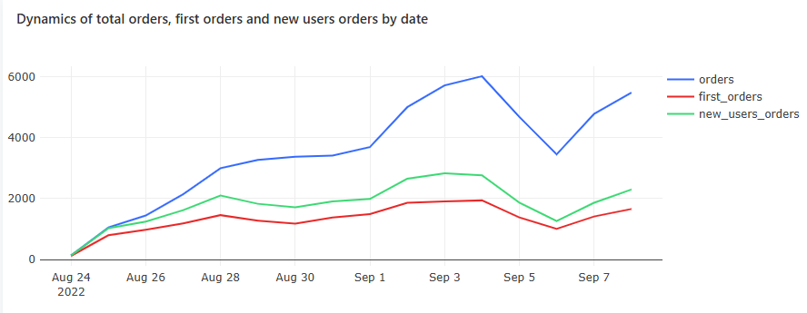

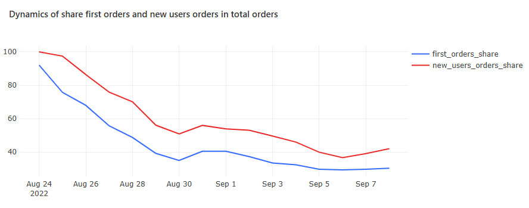


```sql

with sub as (SELECT user_id,
                    min(date(time)) as date
             FROM   user_actions
             WHERE  order_id not in (SELECT order_id
                                     FROM   user_actions
                                     WHERE  action = 'cancel_order')
             GROUP BY 1), 
first_orders_per_user as (SELECT date,
                                 count(distinct user_id) as first_orders
                          FROM   sub
                          GROUP BY 1), 
sub1 as (SELECT user_id,
                min(date(time)) as date
         FROM   user_actions
         WHERE  action = 'create_order'
         GROUP BY 1), 
first_day_orders as (SELECT sub1.user_id,
                            sub1.date,
                            t2.order_id
                     FROM   sub1
                     INNER JOIN (SELECT DISTINCT
                                        order_id,
                                        date(time) as date,
                                        user_id
                                 FROM   user_actions
                                 WHERE  order_id not in (SELECT order_id
                                                         FROM   user_actions
                                                         WHERE  action = 'cancel_order')
                                   AND  action = 'create_order') t2 using(user_id, date)), 
rezult as (SELECT date,
                  count(order_id) as new_users_orders
           FROM   first_day_orders
           GROUP BY 1), 
all_orders as (SELECT t3.date,
                      t3.orders,
                      first_orders_per_user.first_orders
               FROM   (SELECT date(time) as date,
                              count(distinct order_id) as orders
                       FROM   user_actions
                       WHERE  order_id not in (SELECT order_id
                                               FROM   user_actions
                                               WHERE  action = 'cancel_order')
                       GROUP BY 1) t3
               LEFT JOIN first_orders_per_user using(date))
SELECT date,
       orders,
       first_orders,
       new_users_orders,
       round(first_orders::decimal/orders*100, 2) as first_orders_share,
       round(new_users_orders::decimal/orders*100, 2) as new_users_orders_share
FROM   all_orders
LEFT JOIN rezult using(date)

```

**Вопросы:**
> 1) Какая в целом динамика у абсолютных показателей? Можно ли сказать, что вместе с ростом количества всех заказов растут показатели числа первых заказов и числа заказов новых пользователей?
> 2) Что можно сказать о динамике относительных показателей? Можно ли считать её в целом закономерной? Как, на ваш взгляд, будут вести себя эти показатели в долгосрочной перспективе: они будут расти или снижаться?

**Ответы:**
> 1) Динамика абсолютных показателей в целом положительная. Да, вместе с ростом количества всех заказов растут показатели числа первых заказов и числа заказов новых пользователей
> 2) Динамика относительных показателей отрицательная. Ее можно считать в целом закономерной. Можно предположить, что с ростом общего числа заказов, растет число повторных заказов пользователей. Создадим запрос, где проследим долю повторных заказов пользователей в общем числе заказов и отразим это на графике

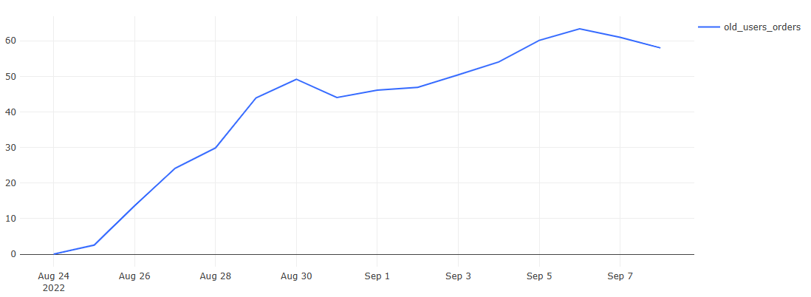

>  На графике видим, что доля повторных заказов пользователей в общем числе заказов растет, поэтому динамика долей первых заказов и заказов новых пользователей отрицательная. В долгосрочной перспективе эти показатели будут снижаться, при условии, что старые пользователи будут делать все больше заказов


--- 


### Динамика числа пользователей и заказов на одного курьера


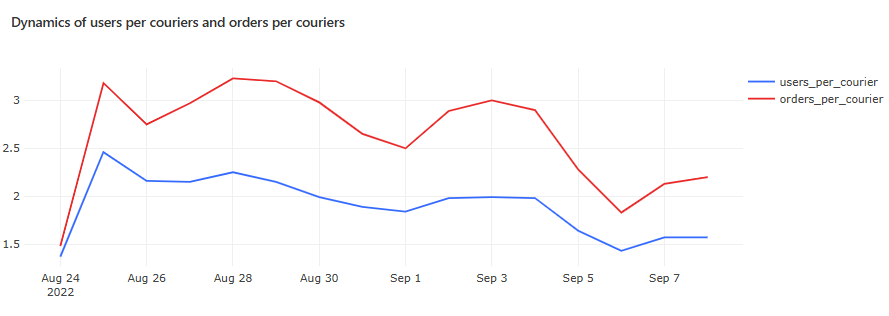

```sql

with daily_users as (SELECT date(time) as date,
                            count(distinct user_id) as users_count
                     FROM   user_actions
                     WHERE  action = 'create_order'
                        and order_id not in (SELECT order_id
                                          FROM   user_actions
                                          WHERE  action = 'cancel_order')
                     GROUP BY 1), 
daily_couriers as (SELECT date(time) as date,
                          count(distinct courier_id) as couriers_count
                   FROM   courier_actions
                   WHERE  order_id not in (SELECT order_id
                                           FROM   user_actions
                                           WHERE  action = 'cancel_order')
                   GROUP BY 1), 
orders_per_day as (SELECT date(creation_time) as date,
                          count(distinct order_id) as orders
                   FROM   orders
                   WHERE  order_id not in (SELECT order_id
                                           FROM   user_actions
                                           WHERE  action = 'cancel_order')
                   GROUP BY 1)
SELECT date,
       round (users_count::decimal / couriers_count, 2) as users_per_courier,
       round(orders::decimal / couriers_count, 2) as orders_per_courier
FROM   daily_users
    LEFT JOIN daily_couriers using(date)
    LEFT JOIN orders_per_day using(date)
ORDER BY date

```

**Вопросы:**
> 1) Совпадает ли в целом динамика рассматриваемых показателей? Если да, то почему так происходит?
> 2) Как изменяются рассматриваемые показатели? Они скорее растут или, наоборот, падают? 
> 3) Как вы считаете, достаточно ли высокая нагрузка у курьеров нашего сервиса? Стоит ли сервису продолжать увеличивать количество курьеров или, наоборот, сейчас лучше приостановить наращивание их численности?

**Ответы:**
> 1) Да, в целом динамика рассматриваемых показателей совпадает, так как с ростом общего числа пользователей растет и количество их заказов
> 2) Рассматриваемые показатели растут. В начале периода: 1,48 заказа и 1,37 пользователя на одного курьера и 2,2 заказа и 1,57 пользователя в конце периода. На протяжении всего периода показатели колеблются от 1,48 до 3,23 для заказов и от 1,37 до 2,46 для пользователей
> 3) В конце рассматриваего периода показатель составлял 2,2 заказа на курьера. Я считаю, что такая нагрузка является оптимальной. Сейчас лучше приостановить наращивание численности курьеров, но численность следует увеличивать с ростом числа ежедневных заказов, чтобы показатели оставались на оптимальном уровне


--- 


### Среднее время доставки заказа

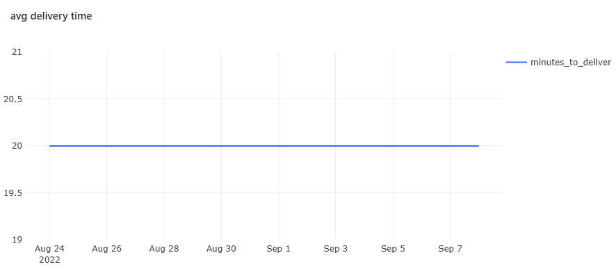 

```sql

with accept_order as (SELECT date(time) as date,
                             courier_id,
                             order_id,
                             time
                      FROM   courier_actions
                      WHERE  action = 'accept_order'
                         and order_id not in (SELECT order_id
                                           FROM   user_actions
                                           WHERE  action = 'cancel_order')), 
deliver_order as (SELECT date(time) as date,
                         courier_id,
                         order_id,
                         time
                  FROM   courier_actions
                  WHERE  action = 'deliver_order'
                  and order_id not in (SELECT order_id
                                       FROM   user_actions
                                       WHERE  action = 'cancel_order')), 
orders as (SELECT date,
                  courier_id,
                  order_id,
                  extract(epoch FROM   (deliver_order.time - accept_order.time)) / 60 as minutes
           FROM   accept_order
           INNER JOIN deliver_order using (date, courier_id, order_id))
SELECT date,
       round(avg(minutes)::int, 0)::int as minutes_to_deliver
FROM   orders
GROUP BY 1

```

**Вопросы:**
> 1) Какое, скорее всего, время ожидания доставки заказа в нашем сервисе? Получается ли у курьеров придерживаться этого целевого показателя?


**Ответы:**
> 1) Время ожидания доставки в нашем сервисе составляет 20 минут. Да, у курьеров получается придерживаться целевого показателя


--- 


### Динамика показателя Cancel Rate и числа успешных/отменённых заказов (по часам в течении дня)


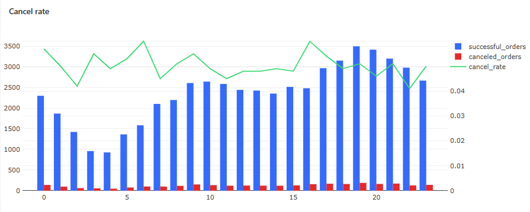 


```sql

with suc_orders as (SELECT extract(hour
                    FROM   creation_time)::int as hour, count(distinct order_id) as successful_orders
                    FROM   orders
                    WHERE  order_id not in (SELECT order_id
                                            FROM   user_actions
                                            WHERE  action = 'cancel_order')
                    GROUP BY 1), 
can_orders as (SELECT extract(hour FROM   creation_time)::int as hour, 
                      count(distinct order_id) as canceled_orders
               FROM   orders
               WHERE  order_id in (SELECT order_id
                                   FROM   user_actions
                                   WHERE  action = 'cancel_order')
               GROUP BY 1)
SELECT hour,
       successful_orders,
       canceled_orders,
       round (canceled_orders::decimal / (successful_orders+canceled_orders), 3) as cancel_rate
FROM   suc_orders
    INNER JOIN can_orders using (hour)
ORDER BY hour

```

**Вопросы:**
> 1) В какие часы наблюдаются пиковые значения числа оформляемых заказов? В какие часы пользователи совершают меньше всего заказов?
> 2) Прослеживается ли какая-то взаимосвязь между количеством оформляемых заказов и долей отменённых заказов? Растёт ли с увеличением числа заказов показатель cancel rate?


**Ответы:**
> 1) Пиковые значения числа оформляемых заказов наблюдаются с 18:00 до 21:00. Пользователи совершают меньше всего заказов с 3:00 до 4:00
> 2) Взаимосвязь между количеством оформляемых заказов и долей отмененных заказов не прослеживается. С увеличением числа заказов показатель cancel rate не растет.


